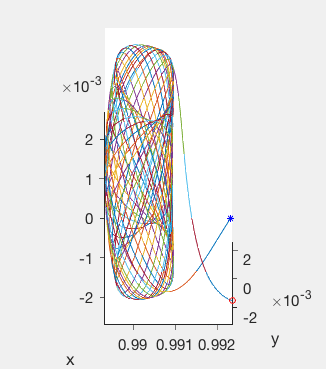
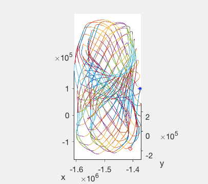
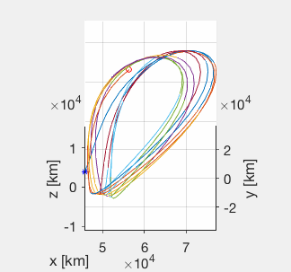

# In progress ...

# Multiple Shooting Method
A brief review of literatures can be found [here](multiple-shooting-method.md).

# Code Structure
| Name | Description |
| -----|-------------|
`./common/` | common files
`./demos/` | demos
`./ephemeris/` | Ephemeris dynamic model using [SPICE/MICE](https://naif.jpl.nasa.gov/naif/) toolbox; some frame kernels.
`./figs/` | figures
`./halo/` | Halo orbit related
`./lissajous/` | Lissajous orbit related
`./lyapunov/` | Lyapunov orbit related
`./rtbp/` | Restricted Three-Body Problem model related.
`./MultipleShooting.m` | multiple-shooting function

# Example Results

## Sun-Earth System
|  |  | 
|-------------|---------|
| `./demons/Demo_02_SunEarthMoon_Lissajous_CRTBP.m` | `./demons/Demo_03_SunEarthMoon_Lissajous_Ephemeris.m` |

## Earth-Moon System
|  | 
|-------------|---------|
| `./demos/Demo_11_EarthMoon_Halo.m` | `./demos/Demo_12_EarthMoon_VerticalLyapunov.m` | 

<!-- | Third order approximation around L1 point -> CRTBP synodic frame. | Third order approximation around L1 point -> ECI Ephemeris -> Earth-centered Rotating frame. | Third order approximation around L1 point -> CRTBP -> ECI Ephemeris -> Earth-centered Rotating frame. -->
<!-- | 分了400段，各点位置精度1e-9，总速度精度1e-7，然后level 2用17次打靶完成，总共128秒 | 日地月星历下，同样的分了400段，各点位置精度10m，总速度精度0.1m/s，然后level 2用4次打靶完成，总共200秒，很快啊，不过这次开了4核8线程并行。| 52段，略。 -->

# Todos
1. ode45 和 ode113 的算法比较来验证计算精度的设计 (easy, ~2017/12)
2. accept particular constraints described in Prof. Howell's publications. See more in multiple-shooting-method.md (undetermined, ~2017/12)
    1. need to find a test example
2. add basic solar radiation model
2. fly-by problems
3. solve basic or simple low-thrust problems
3. automatically parse some critical input parameters
4. more testing examples
5. improve performance by benchmarking the performance
