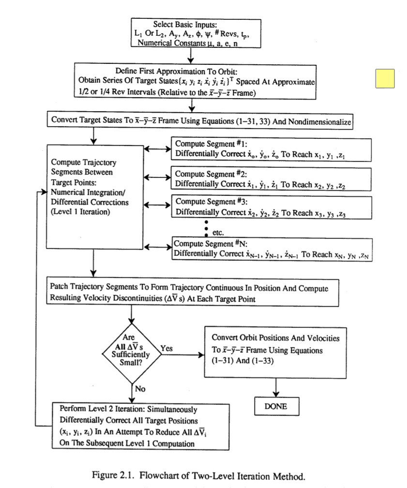

# Multiple Shooting Method

Precisely, I prefer to refer this method as **Two-Level Multiple-Shooting method**. 
Because multiple-shooting can mean a more general kind of method, but here, the method use a two-level strategy to vary time, position, and velocity separately. 

The following flowchart is given by ([Pernicka1990](#1990)). 

It is very clear that
- Level-1 shooting is sequential ([Marchand2007](#2007)). It connects all the segment. 
- Level-2 shooting only modify the level-1 output once. In my opinion, level-2 is **not an iteration process**. Its modification on [t, x, y, z]_n (n=1,2,...,N) is carried out for just one time after every level-1 shotting.
- Level-1 shooting is embedded as one precess 

There are at least two kinds of level-1 shooting:
1. Vary [vy vy vz]. See [Parker2014](#2014), [Marchand2007](#2007) ...
2. Vary [vx vy vz], tf. See ...

The corresponding level-2 should be slightly different. 

# Literatures
整理 multiple shooting (or multiple differential correction）的文献和思路

## 2014
> Parker, Jeffrey S., and Rodney L. Anderson. 2014. Low-Energy Lunar Trajectory Design. 1st ed. JPL Deep-Space Communications and Navigation Series, July. Wiley. http://descanso.jpl.nasa.gov/Monograph/series12_chapter.cfm?force_external=0.

(A free version is [available here](https://descanso.jpl.nasa.gov/monograph/series12/LunarTraj--Overall.pdf))

The multiple shooting part is almost the same to ([Marchand2007](#2007)). 
But the book itself contains much more information. 

## 2007
> Marchand, Belinda G., Kathleen C. Howell, and Roby S. Wilson. 2007. “Improved Corrections Process for Constrained Trajectory Design in the N-Body Problem.” Journal of Spacecraft and Rockets 44 (4):884–97. https://doi.org/10.2514/1.27205.

(A free version is [available here](https://engineering.purdue.edu/people/kathleen.howell.1/Publications/Journals/2006_JSR_MarHowWil.pdf).)

Level-1 shooting does not modify final epoch, thus do not modify propagation interval. 

对multiple shooting进行了更细致的推导和算法整理

这里的level1不改变每段积分时间，不改变每段末时间。
[疑问：这种情况是否可以保证收敛？位置3时间1共4约束，3自由变量？为什么要这样设计？添加改变时间的方程并不复杂？]

## 2003
> R. Wilson, Derivation of Differential Correctors Used in GENESIS Mission Design, Tech. Rep. JPL IOM 312.I-03-002 (internal document), Jet Propulsion Laboratory, California Institute of Technology, Pasadena, California, 2003.

## 1998
> Wilson, Roby S. 1998. “Trajectory Design in the Sun-Earth-Moon Four Body Problem.” Phd, Purdue University. https://engineering.purdue.edu/people/kathleen.howell.1/Publications/Dissertations/1998_Wilson.pdf.

设计了Genesis任务的轨道，作为工具，具体推导了multiple shooting的方法。

## 1990
> Pernicka, Henry John. 1990. “The Numerical Determination of Nominal Libration Point Trajectories and Development of a Station-Keeping Strategy.” Ph.D., Purdue University. http://adsabs.harvard.edu/abs/1990PhDT........26P.
 
给出了比较全面的流程图。

仅给出了简要介绍，引用了 ([Howell1987](#1987)), ([Pernicka1986](#1986))。

在这里的level 1可以改变每段的积分时间，或者说末时间。

## 1987
> Howell, Kathleen C., and Henry John Pernicka. 1987. “Numerical Determination of Lissajous Trajectories in the Restricted Three-Body Problem.” Celestial Mechanics 41 (1–4):107–124. https://doi.org/10.1007/BF01238756.

## 1986
> H. Pernicka, "The Numerical Determination of Lissajous Orbits in the Circular Restricted Three-Body Problem," M.S., December 1986.
在[这里](https://engineering.purdue.edu/people/kathleen.howell.1/Publications/masters.html)可以找到信息，但是下载不到论文内容。

# Others

## GMAT中的情况

GMAT seems to be capable of multiple shooting. 

In this tutorial of [Chapter 9. Optimal Lunar Flyby using Multiple Shooting Tutorials](http://gmat.sourceforge.net/doc/R2016a/html/OptimalLunarFlyby.html), it says

> In this tutorial, you will learn how to design flyby trajectories by writing a GMAT script to perform **multiple shooting optimization**.

However, I am very suspect that this is only break a whole trajectory into several segments, and then smoothly connect them using shooting method. 
See blow,

> To efficiently solve the problem, we will employ the **Multiple Shooting Method** to break down the sensitive boundary value problem into **smaller, less sensitive problems**. We will employ **three trajectory segments**. The first segment will begin at Transfer Orbit Insertion (TOI) and will propagate forward; the second segment is centered at lunar periapsis and propagates both forward and backwards. The third segment is centered on Mission Orbit Insertion (MOI) and propagates forwards and backwards. See figures 1 and 2 that illustrate the final orbit solution and the “Control Points” and “Patch Points” used to solve the problem.

It does not imply any information about two-level strategy. 

This is different from the two-level multiple-segment shooting method discussed in this page. 

# Open Questions to me

1. Is two-level multiple-segment shooting method supervisor than a direct multiple-segment shotting method?